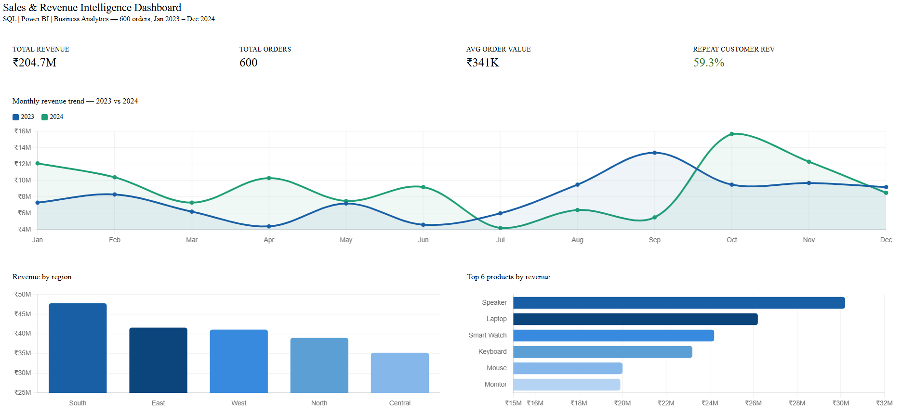
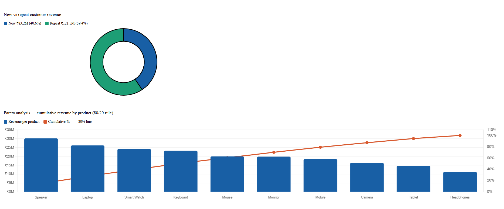

# Sales & Revenue Intelligence Dashboard


---
Sales and revenue intelligence dashboard project using Python, Excel, SQL concepts, and Power BI for KPI reporting, regional sales analysis, and business performance insights.
## Overview

This project focuses on sales and revenue intelligence using Python-generated datasets and Power BI dashboards.

The dashboard helps businesses analyze:
- Revenue trends
- Product performance
- Regional sales distribution
- Customer purchasing behavior
- KPI performance metrics

The project simulates a real-world business intelligence workflow involving sales analytics, KPI tracking, trend analysis, and executive dashboard reporting.

---

## Business Problem

Businesses often struggle with fragmented sales data and lack centralized reporting for tracking revenue performance and customer purchasing trends. This project demonstrates how business intelligence dashboards can improve visibility into revenue growth and operational performance.

---

## Tools Used

- Python
- Pandas
- NumPy
- Excel/CSV
- Power BI
- SQL Concepts

---

## Key Features

- Revenue Trend Analysis
- KPI Dashboarding
- Regional Sales Analysis
- Product Performance Tracking
- Pareto (80/20) Analysis
- Executive Reporting

---

## Business Impact

- Improved sales visibility
- Faster business reporting
- Better KPI tracking
- Enhanced decision-making through dashboards

---

## Project Structure

```text
sales-revenue-dashboard/
│
├── data/
│   ├── sales_data.csv
│
├── notebooks/
│   ├── sales_generator.py
│
├── dashboard/
│   ├── powerbi_instructions.md
│   └── screenshots/
│
├── README.md
├── LICENSE
├── .gitignore
```

---

## Dashboard KPIs

- Total Revenue
- Revenue Growth
- Average Order Value
- Total Orders
- Top Performing Regions

---

## Dashboard Preview

### Revenue Analysis Dashboard


### Regional Performance Dashboard


---

## Key Insights

- Top-performing regions contribute majority of revenue
- Certain products drive higher profitability
- Revenue trends show seasonal fluctuations
- Pareto analysis highlights top revenue-generating customers

---

## Skills Demonstrated

- Sales Analytics
- KPI Reporting
- Business Intelligence
- Power BI Dashboarding
- Revenue Analysis
- Data Visualization
- Trend Analysis

---

## Author

Juhi Nakhale  
Data Analyst | Power BI | Fintech Analytics
